<p align="center">
  
</p>

<h1 align="center">Novella</h1>

<p align="center">
  A modern React Native mobile app for discovering and purchasing books and novels.
</p>

<p align="center">
  
  
  
  
  
</p>
---

# 📖 About Novella

Novella is a mobile bookstore application built with React Native and Expo.  
It allows users to browse books and novels, search for titles, manage their cart, and explore a clean and modern reading-focused interface.

The application uses Appwrite as the backend/database solution and Zustand for lightweight global state management.

---

# ✨ Features

- 🔐 User Authentication
  - Sign In
  - Sign Up

- 🏠 Home Screen
  - Browse featured books and novels
  - Explore categories and recommendations

- 🔎 Search System
  - Search books dynamically
  - Filter and discover titles quickly

- 🛒 Cart Management
  - Add/remove items
  - Quantity management
  - Persistent cart state using Zustand

- 👤 User Profile
  - User information
  - Account-related features

---

# 📱 Screens

## Authentication

<p align="center">
  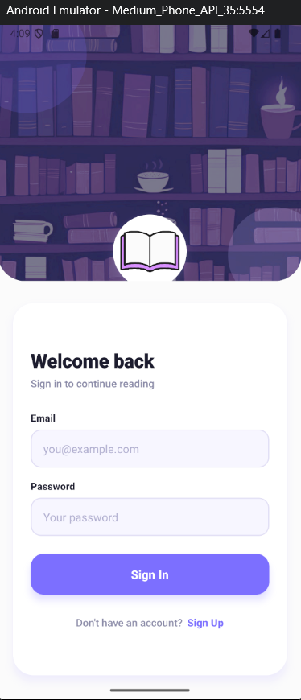
  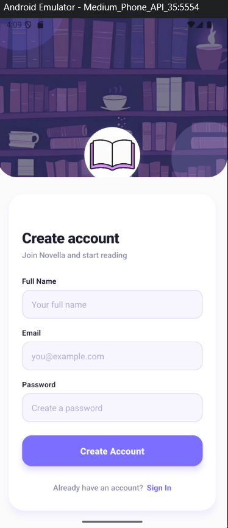
</p>

---

## Home Screen

<p align="center">
  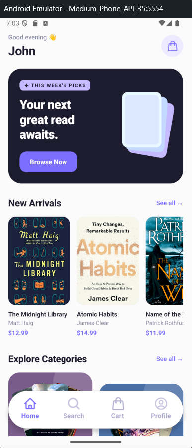
  &nbsp;&nbsp;&nbsp;
  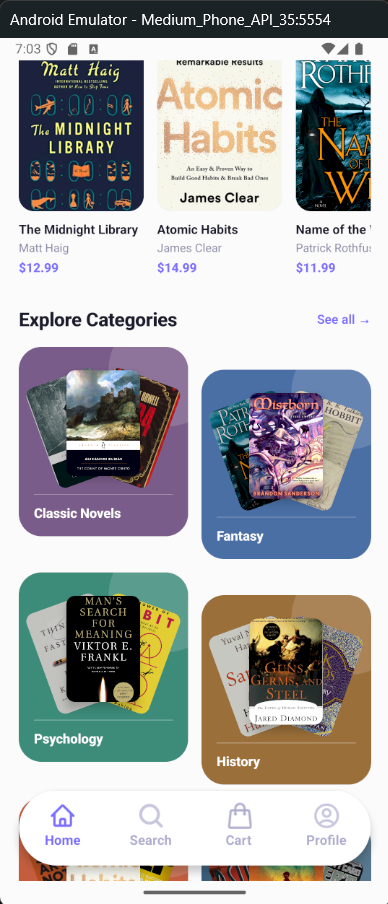
  &nbsp;&nbsp;&nbsp;
  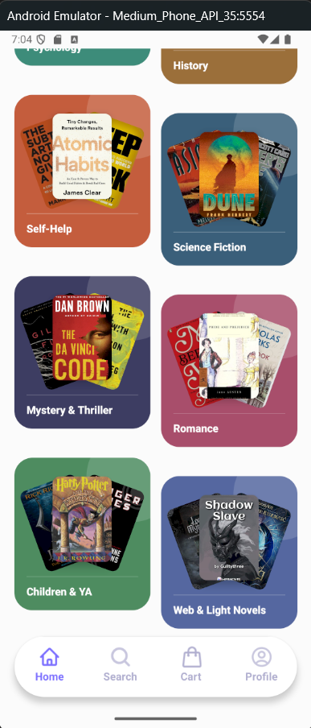
</p>

---

## Search Screen

<p align="center">
  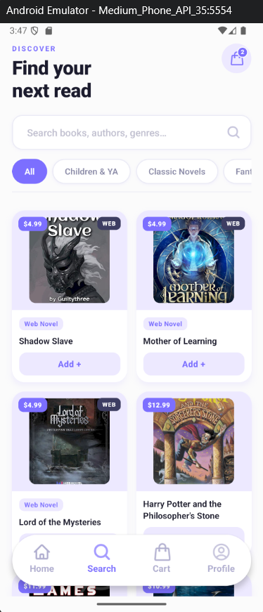
  &nbsp;&nbsp;&nbsp;
  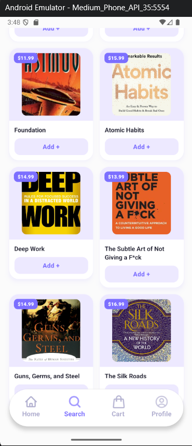
</p>

---

## Cart Screen

<p align="center">
  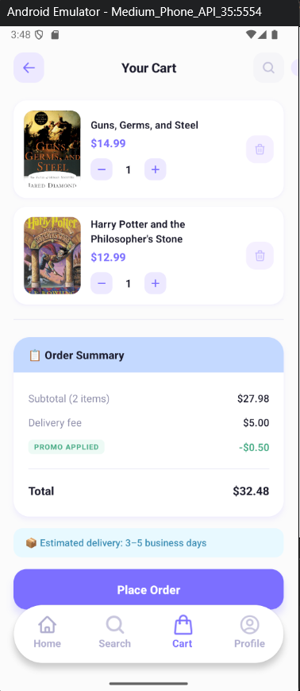
</p>

---

## Book Screen

<p align="center">
  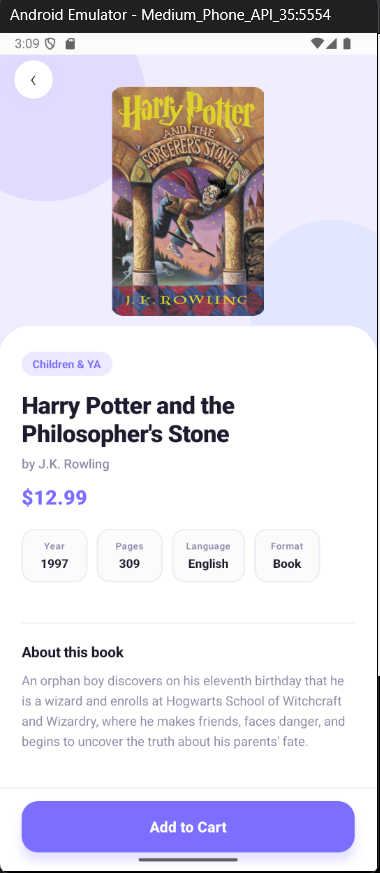
</p>

---

## Profile Screen

<p align="center">
  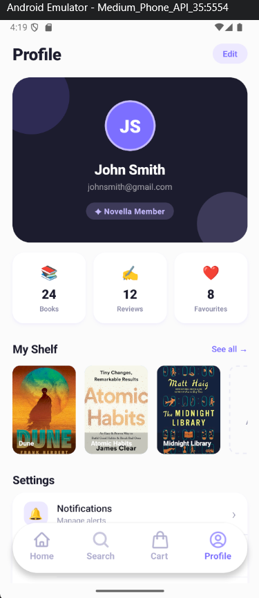
  &nbsp;&nbsp;&nbsp;
  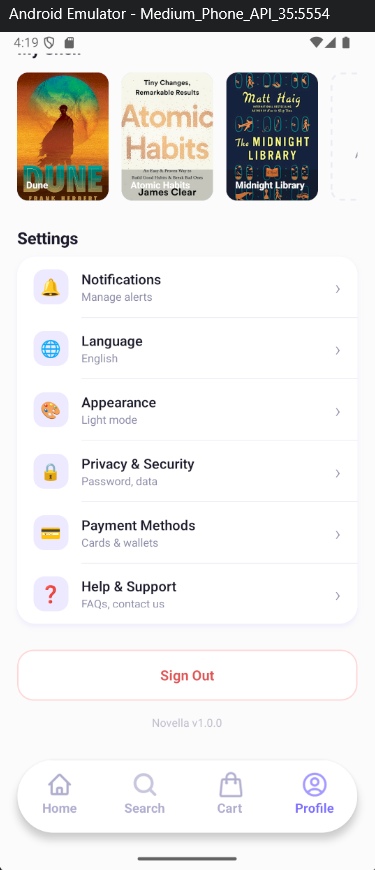
</p>

---

# 🛠️ Tech Stack

- React Native
- Expo
- Expo Router
- TypeScript
- Zustand
- Appwrite
- NativeWind / Stylesheets

---

# 📂 Project Structure

```bash
app/                # Expo Router screens
components/         # Reusable UI components
constants/          # Static data/constants
lib/                # Appwrite config, hooks, utilities
store/              # Zustand stores
assets/             # Images, fonts, icons
types/              # TypeScript types/interfaces
```

---

# 🚀 Getting Started

## 1. Install dependencies

```bash
npm install
```

## 2. Start the application

```bash
npx expo start
```

In the output, you'll find options to open the app in:

- Android Emulator
- iOS Simulator
- Expo Go
- Development Build

---

# 🔧 Environment Variables

Create a `.env` file in the root directory and configure your Appwrite credentials.

Example:

```env
EXPO_PUBLIC_APPWRITE_PROJECT_ID=
EXPO_PUBLIC_APPWRITE_DATABASE_ID=
EXPO_PUBLIC_APPWRITE_BUCKET_ID=
EXPO_PUBLIC_APPWRITE_ENDPOINT=
```

---

# 🗄️ Backend

Novella uses Appwrite for:

- Authentication
- Database management
- File storage
- API services

---

# 📦 State Management

Global state management is handled using Zustand.

Examples:

- Cart state
- Quantity management
- Shared app state

---

# 🧭 Routing

The project uses Expo Router with file-based routing.

Example:

```bash
app/
 ├── index.tsx
 ├── search.tsx
 ├── cart.tsx
 ├── profile.tsx
```
